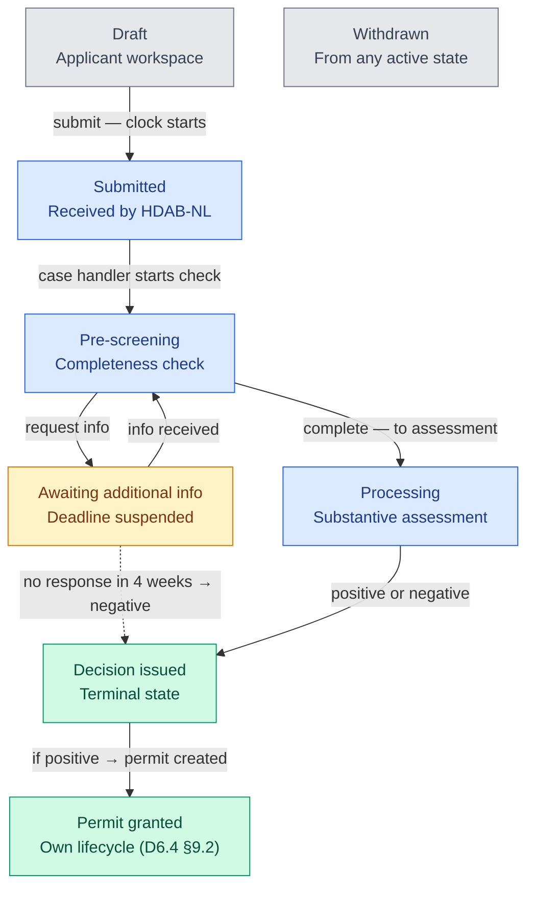

# HDAB-NL DAAMS

> **Disclaimer:** This is an independent, community-built open-source project. It is **not** an official
> product of, and is **not** affiliated with, endorsed by, or reviewed by, the European Commission,
> TEHDAS2, HealthData@EU, or any national Health Data Access Body. "HDAB-NL" is a **fictional example
> organisation** used throughout this codebase to illustrate what a national DAAMS implementation could
> look like based on the publicly published TEHDAS2 deliverables (D6.2/D6.3/D6.4) — it does not represent
> a real Dutch authority or an EHDS reference implementation. Use at your own risk; see [LICENSE](./LICENSE).

**Community DAAMS implementation** — a **Data Access Application Management System** for a fictional "HDAB-NL", built to explore the TEHDAS2 national workflow for the European Health Data Space (EHDS) Regulation (EU) 2025/327.

## Features

- **Full TEHDAS2 DAAMS workflow** — 7-state application lifecycle plus a 5-state permit lifecycle (see below)
- **Two application types** — Data Access Application (Art. 67) and Data Request (Art. 69, anonymised)
- **Statutory deadlines** — EHDS decision deadline (Art. 68): 3 months for standard applicants (extendable by 3) or 2 months for the accelerated public-body track (extendable by 1); 4-week incomplete response window; visual overdue/warning indicators
- **Role-based transitions** — APPLICANT, CASE_HANDLER, DECISION_MAKER, DATA_HOLDER, ADMIN
- **Case dashboard** — KPIs, overdue alerts, status breakdown, recent activity
- **Audit trail** — immutable log of every state transition with actor, timestamp, and comment
- **Notes** — internal (staff-only) and external notes per application
- **EHDS common form** — application form aligned with TEHDAS2 D6.2 fields, with type-specific sections (Annex 5 vs Annex 6)

## Functionality → EHDS articles

What's implemented, and the specific EHDS Regulation (EU) 2025/327 article (or TEHDAS2 D6.x
reference) it's based on. See [`docs/architecture.md`](./docs/architecture.md) for how these pieces
fit together in code.

| Functionality | EHDS / TEHDAS2 reference |
|---|---|
| Application submission & lifecycle | Art. 67 (data access application), Art. 69 (data request) |
| Statutory decision deadlines (standard 3 months +3; accelerated 2 months +1; 4-week info window) | Art. 68, Art. 69 |
| Structured completeness check (checklist, distinct from assessment) | D6.3 Ch. 5, Annex 7/8 |
| Type-specific application fields (cohort formation, controls/relatives, tabulation plan, transfers outside EU/EEA, lawfulness of processing) | D6.3 Annex 5 (data access application) / Annex 6 (data request) |
| Ethical review tracking (status, committee, reference) | D6.3 §6.1 |
| Cost estimate & invoicing sent to the applicant | Art. 62(5) |
| Opt-out exception mechanism | Art. 71(4) |
| Decision issuance & data permit creation | Art. 68(1)–(3) |
| Data permit document (10-section template) | D6.3 Annex 9; mandatory content per Art. 68(10) |
| Permit validity, amendment, renewal (once) | Art. 68(12) |
| Permit revocation for non-compliance | Art. 63(1) |
| List of persons authorised to process data in the SPE | D6.3 Annex 9 §6.8, Art. 73 |
| Extraction requests to health data holders | Art. 60, Art. 68(7) |
| Appeal (bezwaar/beroep) tracking against a decision | Art. 63 / national administrative law |
| Public transparency register (applications & decisions) | Art. 57(1)(j)(ii), Art. 58, Art. 61(4) |
| Cross-border application import via HealthData@EU | Art. 75 |
| Role-based access control on every state transition | Art. 57 (HDAB responsibilities), implemented as internal RBAC |
| Immutable audit trail of application & permit changes | supports record-keeping under Art. 57(1) |

Not yet implemented: the trusted-health-data-holder procedure (Art. 72), IPR/trade-secret
contractual arrangements (Art. 52, Annex 11), mutual recognition of another HDAB's permit (Art.
68(5)), the biennial activity report (Art. 59), tracking of the applicant's post-permit results
publication (Art. 61(4)), ongoing compliance monitoring during a permit's validity (Art.
57(1)(a)(ii)), the dataset metadata catalogue (Art. 77–80), and real secure processing environment
integration (only name/requirements are recorded as text today).

## Workflow states

Both application types (data access application and data request) go through the same
`ApplicationStatus` state machine (TEHDAS2 D6.4 §7.6/7.7); a positive decision then spins off a
`DataPermit` with its own lifecycle (D6.4 §9.2).



A granted permit can subsequently be **amended**, **renewed** (once), **revoked**, or expire
(`DataPermitStatus`). From any active application state (`DRAFT` through `PROCESSING`), the
applicant or case handler can withdraw the application.

Blue = HDAB handling · Amber = waiting on applicant · Teal = outcome · Gray = start or exit.

## Tech stack

- **Next.js 15** (App Router, server components)
- **PostgreSQL** + **Prisma** ORM
- **Tailwind CSS**
- TypeScript

## Getting started

```bash
# 1. Start the database
docker compose up -d

# 2. Install dependencies
npm install

# 3. Copy env file and configure
cp .env.example .env

# 4. Push schema and seed demo data
npm run db:push
npm run db:seed

# 5. Start dev server
npm run dev
```

Open [http://localhost:3000](http://localhost:3000).

## References

- [TEHDAS2 D6.4 — Technical Specifications for DAAMS](https://tehdas.eu/wp-content/uploads/2025/09/technical-specifications-for-data-access-application-management-system-daams-for-health-data-access-bodies-hdabs.pdf)
- [TEHDAS2 D6.3 — Guideline for HDABs on procedures and formats](https://tehdas.eu/wp-content/uploads/2025/09/draft-guideline-for-health-data-access-bodies-on-the-procedures-and-formats-for-data-access.pdf)
- [TEHDAS2 D6.2 — Guideline for data users](https://tehdas.eu/wp-content/uploads/2025/10/d6.2-guideline-for-data-users-on-good-application-and-access-practice.pdf)
- EHDS Regulation (EU) 2025/327, Chapter IV (Articles 51–80) — see the functionality table above for specific articles

## License

MIT — see [LICENSE](./LICENSE). This project is provided as-is with no warranty; it is not legal or
compliance advice, and using it does not by itself satisfy any HDAB's obligations under the EHDS
Regulation.
