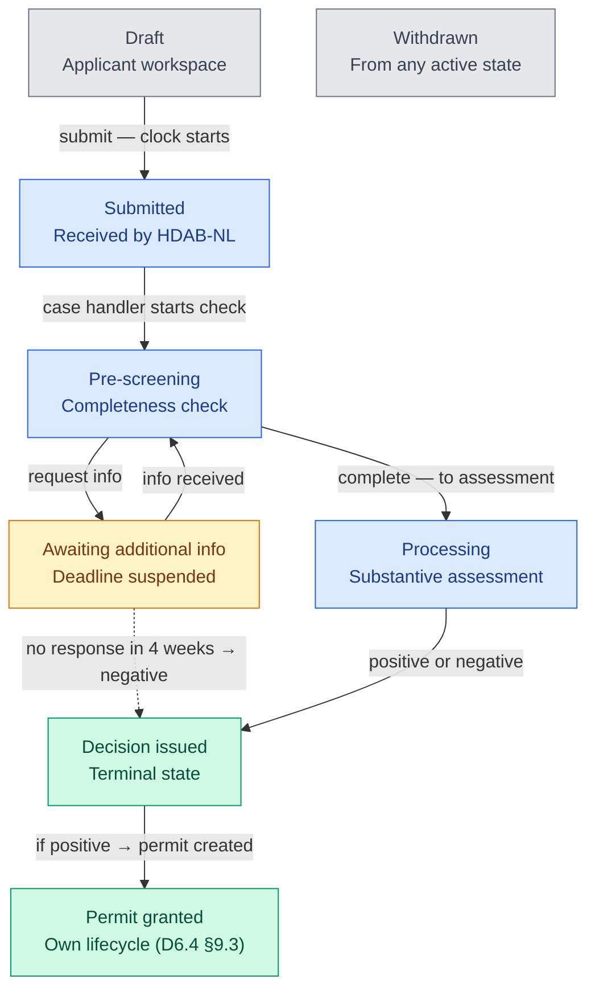

# open-daams

> **Disclaimer:** This is an independent, community-built open-source project. It is **not** an official
> product of, and is **not** affiliated with, endorsed by, or reviewed by, the European Commission,
> TEHDAS2, HealthData@EU, or any national Health Data Access Body. "HDAB-NL" is a **fictional example
> organisation** used throughout this codebase to illustrate what a national DAAMS implementation could
> look like based on the publicly published TEHDAS2 deliverables (D6.2/D6.3/D6.4) — it does not represent
> a real Dutch authority or an EHDS reference implementation. Use at your own risk; see [LICENSE](./LICENSE).

**Community DAAMS implementation** — a **Data Access Application Management System** for a fictional "HDAB-NL", built to explore the TEHDAS2 national workflow for the European Health Data Space (EHDS) Regulation (EU) 2025/327.

## Features

- **Full TEHDAS2 DAAMS workflow** — 7-state application lifecycle plus a 5-state permit lifecycle (see below)
- **Two application types** — Data Access Application (Art. 67) and Data Request (Art. 69, anonymised)
- **Statutory deadlines** — EHDS decision deadline (Art. 68): 3 months for standard applicants (extendable by 3) or 2 months for the accelerated public-body track (extendable by 1); 4-week incomplete response window; visual overdue/warning indicators
- **Role-based transitions** — APPLICANT, CASE_HANDLER, DECISION_MAKER, DATA_HOLDER, ADMIN
- **Case dashboard** — KPIs, overdue alerts, status breakdown, recent activity
- **Audit trail** — append-only log of every application/permit/SPE-provisioning state transition (actor, timestamp, comment), plus a separate log of reference-data (masterdata) changes
- **Notes** — internal (staff-only) and external notes per application
- **EHDS common form** — application form aligned with TEHDAS2 D6.2 fields, with type-specific sections (Annex 5 vs Annex 6)
- **Internationalised UI** — tool chrome available in Dutch, English, and French (`next-intl`); permit content and the issued PDF stay in the issuing HDAB's language by design
- **SPE operator assignment** — HDAB selects an SPE operator at permit issuance or amendment; the SPE provider is derived from the operator's reference-data record, never stored redundantly
- **Trusted data holder flag** — data holders can be marked trusted in the reference-data registry and selected on an application (a first step toward the full Art. 72 procedure — see below)

## Functionality → EHDS articles

What's implemented, and the specific EHDS Regulation (EU) 2025/327 article (or TEHDAS2 D6.x
reference) it's based on. See [`docs/architecture.md`](./docs/architecture.md) for how these pieces
fit together in code.

| Functionality | EHDS / TEHDAS2 reference |
|---|---|
| Application submission & lifecycle | Art. 67 (data access application), Art. 69 (data request) |
| Statutory decision deadlines (standard 3 months +3; accelerated 2 months +1; 4-week info window) | Art. 68, Art. 69 |
| Structured completeness check (checklist, distinct from assessment) | D6.3 Ch. 5, Annex 7/8 |
| Type-specific application fields (cohort formation, controls/relatives, tabulation plan, transfers outside EU/EEA, lawfulness of processing) | D6.3 Annex 5 (data access application) / Annex 6 (data request) |
| Ethical review tracking (status, committee, reference) | D6.3 §6.1 |
| Cost estimate & invoicing sent to the applicant | Art. 62(5) |
| Opt-out exception mechanism | Art. 71(4) |
| Decision issuance & data permit creation | Art. 68(1)–(3) |
| Data permit document (10-section template) | D6.3 Annex 9; mandatory content per Art. 68(10) |
| Permit validity, amendment, renewal (once) | Art. 68(12) |
| Permit revocation for non-compliance | Art. 63(1) |
| List of persons authorised to process data in the SPE — role-differentiated (researcher, auto-derived from the application; output controller, HDAB-selected per D6.3's four-eyes principle), each with a sample DID identity; each granted dataset also carries a signed storage-location write instruction for the data holder | D6.3 Annex 9 §6.8, Art. 73 |
| SPE operator selection at permit issuance/amendment (provider derived from operator) | Art. 73 |
| Extraction requests to health data holders | Art. 60, Art. 68(7) |
| Appeal (bezwaar/beroep) tracking against a decision | Art. 63 / national administrative law |
| Public transparency register (applications & decisions) | Art. 57(1)(j)(ii), Art. 58, Art. 61(4) |
| Cross-border application import via HealthData@EU | Art. 75 |
| Role-based access control, enforced server-side on reads and writes (no real authentication — see [assessments](#assessments)) | Art. 57 (HDAB responsibilities), implemented as internal RBAC |
| Audit trail of application/permit/SPE-provisioning transitions and reference-data changes | supports record-keeping under Art. 57(1) |
| Trusted data holder flag (registry) + selector on an application | Art. 72 — partial, see below |

Not yet implemented: the **full** trusted-health-data-holder referral/assessment procedure (Art.
72 — only the trusted flag and selector exist today, not the referral/proposed-decision
workflow), IPR/trade-secret contractual arrangements (Art. 52, Annex 11), mutual recognition of
another HDAB's permit (Art. 68(5)), the biennial activity report (Art. 59), tracking of the
applicant's post-permit results publication (Art. 61(4)), ongoing compliance monitoring during a
permit's validity (Art. 57(1)(a)(ii)), the dataset metadata catalogue (Art. 77–80), and real
secure processing environment
integration (only name/requirements are recorded as text today).

## Workflow states

Both application types (data access application and data request) go through the same
`ApplicationStatus` state machine (TEHDAS2 D6.4 §7.6); a positive decision then spins off a
`DataPermit` with its own lifecycle (D6.4 §9.3).


```mermaid
flowchart TD
    DRAFT["Draft<br/>Applicant workspace"]
    SUBMITTED["Submitted<br/>Received by HDAB-NL"]
    PRESCREEN["Pre-screening<br/>Completeness check"]
    AWAITING["Awaiting additional info<br/>Deadline suspended"]
    PROCESSING["Processing<br/>Substantive assessment"]
    DECISION["Decision issued<br/>Terminal state"]
    PERMIT["Permit granted<br/>Own lifecycle (D6.4 §9.3)"]
    WITHDRAWN["Withdrawn<br/>From any active state"]

    DRAFT -->|"submit — clock starts"| SUBMITTED
    SUBMITTED -->|"case handler starts check"| PRESCREEN
    PRESCREEN -->|"request info"| AWAITING
    AWAITING -->|"info received"| PRESCREEN
    PRESCREEN -->|"complete — to assessment"| PROCESSING
    AWAITING -.->|"no response in 4 weeks → negative"| DECISION
    PROCESSING -->|"positive or negative"| DECISION
    DECISION -->|"if positive → permit created"| PERMIT

    classDef handling fill:#dbeafe,stroke:#2563eb,color:#1e3a8a;
    classDef waiting fill:#fef3c7,stroke:#d97706,color:#78350f;
    classDef outcome fill:#d1fae5,stroke:#059669,color:#064e3b;
    classDef exit fill:#e5e7eb,stroke:#6b7280,color:#374151;

    class SUBMITTED,PRESCREEN,PROCESSING handling;
    class AWAITING waiting;
    class DECISION,PERMIT outcome;
    class DRAFT,WITHDRAWN exit;
```

A granted permit can subsequently be **amended**, **renewed** (once), **revoked**, or expire
(`DataPermitStatus`). From any active application state (`DRAFT` through `PROCESSING`), the
applicant or case handler can withdraw the application.

Blue = HDAB handling · Amber = waiting on applicant · Teal = outcome · Gray = start or exit.

## Tech stack

- **Next.js 16** (App Router, server components, Turbopack)
- **PostgreSQL** + **Prisma** ORM
- **next-intl** (nl/en/fr UI localisation)
- **Tailwind CSS**
- TypeScript
- **Vitest** — unit tests for the pure `src/lib/` logic (permit lifecycle rules, deadline
  calculations, invoice math, signing payloads)

## Getting started

```bash
# 1. Start the database
docker compose up -d

# 2. Install dependencies
npm install

# 3. Copy env file and configure
cp .env.example .env

# 4. Generate a permit-signing key (Ed25519, used to sign issued data permits)
npm run generate-signing-key

# 5. Push schema and seed demo data
npm run db:push
npm run db:seed

# 6. Start dev server
npm run dev
```

Open [http://localhost:3000](http://localhost:3000).

Run the unit test suite with `npm run test` (or `npm run test:watch` while developing).

### Backups

`npm run db:backup` takes a `pg_dump` of the running database into `backups/` (git-ignored).
`npm run db:restore -- <file>` restores from one. Both resolve the running Postgres container by
the port it publishes, so they work regardless of how `docker compose` named it. This is a manual,
on-demand mechanism — no scheduling, retention, or offsite copy.

## Assessments

This app has **no real authentication** — role-based access control trusts a client-supplied
user id, a documented and deliberate simplification for this reference implementation (see
[`CLAUDE.md`](./CLAUDE.md)). Each assessment below is written against the bar a real deployment
would need to clear, not a certification — see each document's own framing note.

- [`docs/owasp-top10-assessment.md`](./docs/owasp-top10-assessment.md) — OWASP Top 10 (2021)
- [`docs/nis2-assessment.md`](./docs/nis2-assessment.md) — NIS2 (Directive (EU) 2022/2555 /
  Cyberbeveiligingswet)
- [`docs/bio2-assessment.md`](./docs/bio2-assessment.md) — BIO2 (Dutch public-sector baseline,
  ISO/IEC 27002:2022)
- [`docs/wcag-2.1-assessment.md`](./docs/wcag-2.1-assessment.md) — WCAG 2.1 AA (accessibility)
- [`docs/comply-or-explain-assessment.md`](./docs/comply-or-explain-assessment.md) — Forum
  Standaardisatie's "pas toe of leg uit" open-standards list

## References

- [TEHDAS2 D6.4 — Technical Specifications for DAAMS](https://tehdas.eu/wp-content/uploads/2026/06/d6.4-data-access-application-management-system-daams-technical-specification-for-health-data-access-bodies.pdf)
- [TEHDAS2 D6.3 — Guideline for HDABs on procedures and formats](https://tehdas.eu/wp-content/uploads/2025/09/draft-guideline-for-health-data-access-bodies-on-the-procedures-and-formats-for-data-access.pdf)
- [TEHDAS2 D6.2 — Guideline for data users](https://tehdas.eu/wp-content/uploads/2025/10/d6.2-guideline-for-data-users-on-good-application-and-access-practice.pdf)
- EHDS Regulation (EU) 2025/327, Chapter IV (Articles 51–80) — see the functionality table above for specific articles

## License

MIT — see [LICENSE](./LICENSE). This project is provided as-is with no warranty; it is not legal or
compliance advice, and using it does not by itself satisfy any HDAB's obligations under the EHDS
Regulation.
